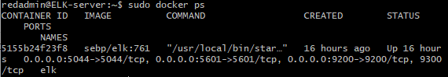

## Automated ELK Stack Deployment

The files in this repository were used to configure the network depicted below.

These files have been tested and used to generate a live ELK deployment on Azure. They can be used to either recreate the entire deployment pictured above. Alternatively, select portions of the playbook files may be used to install only certain pieces of it, such as Filebeat.

  - [Ansible Config](https://github.com/Hester314/Project-1/blob/8e18d692155974f6eb90baf4efb890b3d70dac5c/Ansible/ansible.cfg)
  - [Ansible Hosts](https://github.com/Hester314/Project-1/blob/8e18d692155974f6eb90baf4efb890b3d70dac5c/Ansible/hosts)
  - [Docker Install and Setup](https://github.com/Hester314/Project-1/blob/8e18d692155974f6eb90baf4efb890b3d70dac5c/Ansible/playbooks/firstplaybook.yaml)
  - [ELK Install](https://github.com/Hester314/Project-1/blob/8e18d692155974f6eb90baf4efb890b3d70dac5c/Ansible/install-elk.yml)
  - [Metricbeat Install](https://github.com/Hester314/Project-1/blob/8e18d692155974f6eb90baf4efb890b3d70dac5c/Ansible/roles/metricbeat-playbook.yml)
  - [Metricbeat Config](https://github.com/Hester314/Project-1/blob/8e18d692155974f6eb90baf4efb890b3d70dac5c/Ansible/files/metricbeat-config.yml)
  - [Filebeat Install](https://github.com/Hester314/Project-1/blob/8e18d692155974f6eb90baf4efb890b3d70dac5c/Ansible/roles/filebeat-playbook.yml)
  - [Filebeat Config](https://github.com/Hester314/Project-1/blob/8e18d692155974f6eb90baf4efb890b3d70dac5c/Ansible/files/filebeat-config.yml)

This document contains the following details:
- Description of the Topology
- Access Policies
- ELK Configuration
  - Beats in Use
  - Machines Being Monitored
- How to Use the Ansible Build

### Description of the Topology

The main purpose of this network is to expose a load-balanced and monitored instance of DVWA, the D*mn Vulnerable Web Application.

Load balancing ensures that the application will be highly available, in addition to restricting access to the network.
- A load balancer protects the availability of web servers during times of high traffic or server outages. It does this by distributing traffic to a backend pool which consists of multiple servers. By using a jump box, a user can connect to multiple web servers and make changes. Jump boxes also allow for tighter security because you can allow access to the jump box only from specific IPs and ports.

Integrating an ELK server allows users to easily monitor the vulnerable VMs for changes to the files and system metrics.
- Filebeat watches for any specific activity within the file system and logs it.
- Metricbeat records machine metrics (uptime, memory, cpu usage, etc.).

The configuration details of each machine may be found below.

| Name       | Function   | IP Address | Operating System |
|------------|------------|------------|------------------|
| jump-box   | Gateway    | 10.0.0.4   | Linux            |
| Web-1      | Web Server | 10.0.0.8   | Linux            |
| Web-2      | Web Server | 10.0.0.7   | Linux            |
| ELK-server | Monitoring | 10.1.0.4   | Linux            |

### Access Policies

The machines on the internal network are not exposed to the public Internet. 

Only the jump-box machine can accept connections from the Internet. Access to this machine is only allowed from the following IP addresses:
- 73.3.19.242 (personal PC)

Machines within the network can only be accessed by the jump-box VM.
- Access to the ELK-server VM was only allowed through the jump-box VM (IP: 10.1.0.4).

A summary of the access policies in place can be found in the table below.

| Name          | Publicly Accessible | Allowed IP Addresses     |
|---------------|---------------------|--------------------------|
| jump-box      | no                  | Personal PC: 73.3.19.242 |
| Web-1         | no                  | 10.0.0.4                 |
| Web-2         | no                  | 10.0.0.4                 |
| Load Balancer | no                  | Personal PC: 73.3.19.242 |
| ELK-server    | no                  | Personal PC: 73.3.19.242 |

### Elk Configuration

Ansible was used to automate configuration of the ELK machine. No configuration was performed manually, which is advantageous because...
- Automation allows for faster and more consistent deployments.

The playbook implements the following tasks:
- The first three tasks in the install-elk.yml file make sure that the docker.io, python3-pip, and docker module are all installed and running.
- The next step is to incrrease the system's virtual memory by using sysctl. This allows for more logs to be stored by the system.
- Next, the task is to download and launch the docker elk container "sepb/elk:761" and allow ports 5601, 9200, and 5044 to use the ELK-server.
- Lastly, the docker service is instructed to run when the container is booted.

The following screenshot displays the result of running `docker ps` after successfully configuring the ELK instance.

### Target Machines & Beats
This ELK server is configured to monitor the following machines:
- Web-1: 10.0.0.8
- Web-2: 10.0.0.7

We have installed the following Beats on these machines:
- Filebeat
- Metricbeat

These Beats allow us to collect the following information from each machine:
- Filebeat collects log data from specific system logs. For example, filebeat can log activity that specifically takes place using Microsoft Azure tools.
- Metricbeat collects system metric data. This can be system uptime, cpu usage, memory usage, etc.

### Using the Playbook
In order to use the playbook, you will need to have an Ansible control node already configured. Assuming you have such a control node provisioned: 

SSH into the control node and follow the steps below:
- Copy the install_elk.yml file to /etc/ansible.
- Update the hosts file to include IP addresses for ELK server and webserver host groups. ([elk]&[webservers])
- Run the playbook, and navigate to http://[Elk_VM_Public_IP]:5601/app/kibana to check that the installation worked as expected.
